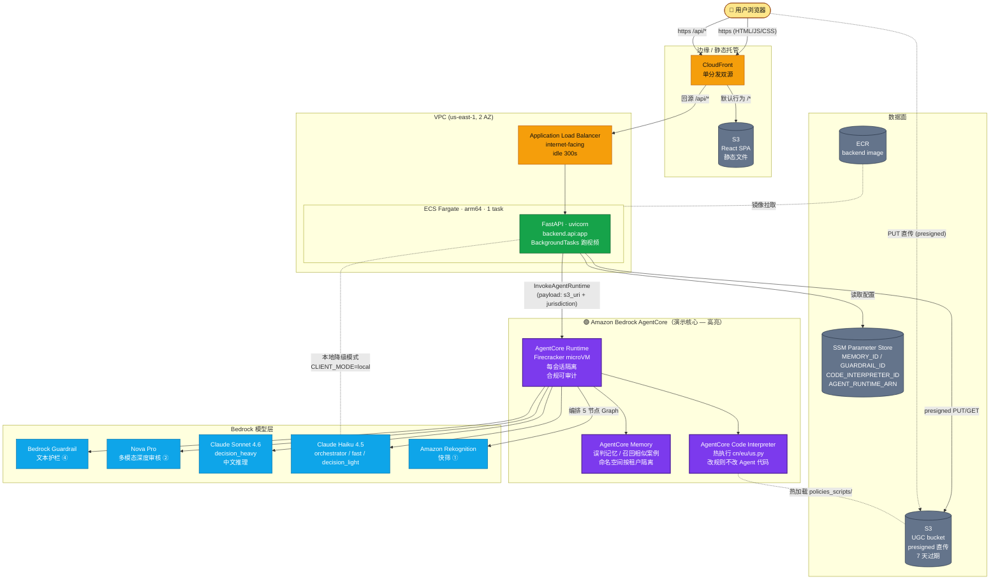
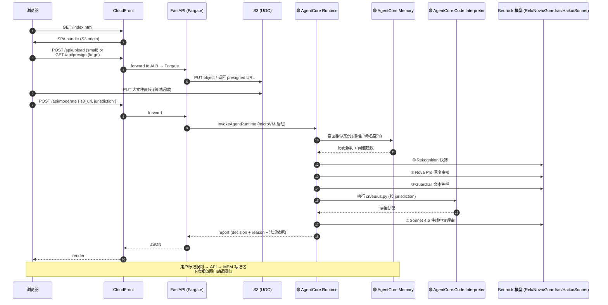

# Cloud Architecture — UGC Moderation Demo

> 部署目标：客户 Demo / POC，单 region (us-east-1)，前后端全部上 AWS。
> AgentCore 三件套（Runtime / Memory / Code Interpreter）+ Guardrail 是核心，下图用**紫色高亮**。

## 全局视图

## AgentCore 组件在请求路径中的位置

## 关键设计决策

| 决策 | 取舍 |
|---|---|
| **CloudFront 单分发双源** | 一个域名同时服务前端和 API → 前端不用 CORS、cookie 不跨站。代价：失效缓存要走 `/api/*` 单独行为。 |
| **ALB internet-facing（不上 ACM）** | CloudFront → ALB 走 HTTP（VPC 出口仍是公网）。Demo 简化，省证书和 DNS。生产应改 internal ALB + VPC Origin。 |
| **Fargate arm64 单 task** | 与 `.bedrock_agentcore.yaml` 对齐；Demo 并发 ≤5，单 task 1vCPU/2GB 足够。 |
| **视频走 BackgroundTasks 而非 SQS** | 现有 `pipeline_video.py` 进度字典在内存，单进程 + 单 task = 进度查询能命中。生产换 SQS+DynamoDB。 |
| **UGC 与 Site bucket 分离** | UGC bucket 7 天过期 + presigned 直传；Site bucket 给 CloudFront OAC，私有。 |
| **配置走 SSM 而非环境变量** | `MEMORY_ID/GUARDRAIL_ID/CODE_INTERPRETER_ID/AGENT_RUNTIME_ARN` 由初始化脚本生成 → 写 SSM → ECS task 启动注入。换 ID 不用重建镜像。 |
| **AgentCore Runtime 已存在不重建** | `.bedrock_agentcore.yaml` 里 `agent_arn` 直接复用，CDK 不接管。CDK 只管前后端基础设施。 |
| **CLIENT_MODE=remote** | Fargate 后端调远程 AgentCore Runtime（microVM 隔离）。本地开发还是 `local`，与生产隔离。 |

## 成本（us-east-1，Demo 7×24）

| 资源 | 月成本 |
|---|---|
| Fargate 1 task (1vCPU / 2GB / arm64) | ~$30 |
| ALB (internet-facing) | ~$18 |
| NAT Gateway × 1 | ~$33 |
| CloudFront + S3 静态 | <$2 |
| S3 (UGC + Site) | <$2 |
| ECR (1 image) | <$1 |
| **基础设施小计** | **~$85/月** |
| **AgentCore + Bedrock 调用** | 按用量另算（最大头） |

> 演示前 1 小时启停模式：把 desired_count 调到 0，跌到 ~$50（剩 ALB + NAT）。

## 不在本架构里的（生产再加）

- WAF、Cognito 认证、API Key
- SQS + DynamoDB（异步任务）
- 多租户隔离（命名空间已有，但没有 quota / 限流）
- 多 AZ NAT（成本翻倍）
- 蓝绿发布、Canary
- X-Ray / OTel 全链路追踪
